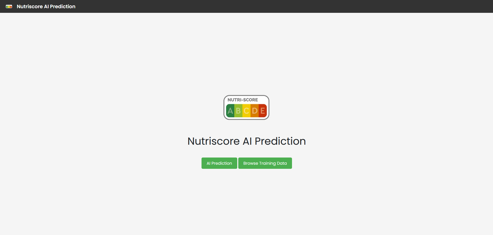
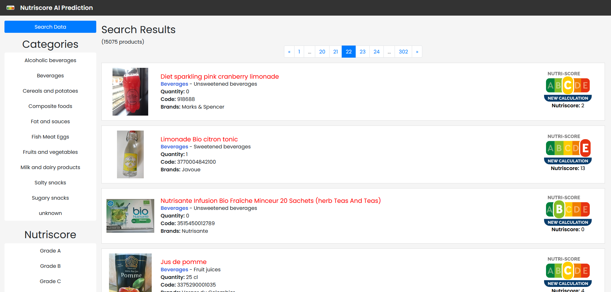
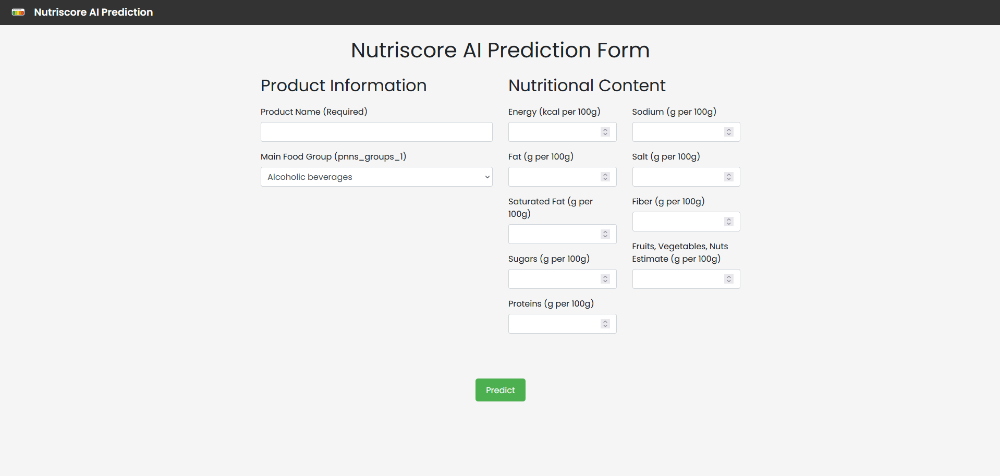

### **<h1 align="center">Nutri-Score Prediction AI Model</h1>**

<p align="center">
  
</p>

This project is a machine learning application designed to predict the Nutri-Score of food products based on various nutritional data. The application is developed in Python with a Flask-based interface, enabling local predictions and a dynamic web-based display of product data.

---



---

### **Table of Contents**

1. [Features](#features)
2. [Installation](#installation)
3. [Usage](#usage)
4. [Model Details](#model-details)
5. [Technologies Used](#technologies-used)
6. [Project Structure](#project-structure)
7. [How the Project Works](#how-the-project-works)
8. [Future Improvements](#future-improvements)

---

### **Features**

- **Nutri-Score Prediction**: Predicts Nutri-Score grades using machine learning models trained on Open Food Facts data.
- **Data Exploration and Cleaning**: Uses various preprocessing techniques, such as handling missing values and outliers, to ensure model accuracy.
- **Dynamic Frontend with Pagination**: A web interface displaying product data, allowing users to search and filter by Nutri-Score and other nutritional characteristics.

---

### **Installation**

1. Clone the repository:
   ```bash
   git clone https://github.com/TonyVallad/Nutriscore-Prediction-Model.git
   cd Nutriscore-Prediction-Model
   ```

2. Install dependencies:
   ```bash
   pip install -r requirements.txt
   ```

3. Download the data:
   - Go to [Open Food Facts](https://fr.openfoodfacts.org/data).
   - Download the CSV file with the product data and place it in the `static` folder.

4. Run the application:
   ```bash
   python run.py
   ```

---

### **Usage**

- Start the application and navigate to `http://127.0.0.1:5000/` in your browser.
- Use the interface to explore product data and predict Nutri-Score grades.

#### Key Routes

- **Homepage (`/`)**: Displays an introductory page with navigation options.
- **API Prediction Endpoint (`/api/v1/predict-nutriscore`)**: Allows users to make predictions via a separate API route.
- **Product Listing (`/training_data`)**: Browse and search products with pagination and filters.
- **Search Data**: Filter products based on categories and Nutri-Score grades.





---

### **Model Details**

The application uses a RandomForestClassifier by default, but you can experiment with additional models by updating `create_ai_model.py`. The trained model is saved in `app/ai-model/`.

---

### **Technologies Used**

- **Python**: Core language for data processing and machine learning.
- **Flask**: Web framework for the application interface.
- **Scikit-learn**: Machine learning library for model development.
- **Jinja2**: Templating engine for dynamic HTML generation.

---

### **Project Structure**

```plaintext
Nutriscore-Prediction-Model/
│
├── app/
│   ├── ai-model/            # Model and related files
│   ├── routes/              # Core application routes (split by functionality)
│   ├── static/              # Static assets (CSV data, images, CSS)
│   ├── templates/           # HTML templates
│   ├── __init__.py          # Application factory
│
├── config.py                # Configuration file
├── requirements.txt         # Dependencies
├── run.py                   # Main entry point
└── README.md                # Project documentation
```

---

### **How the Project Works**

1. **Data Preparation**: Loads and preprocesses the Open Food Facts dataset, handling missing values, outliers, and scaling features.
2. **Model Training**: Trains a machine learning model to predict Nutri-Score based on selected features.
3. **Frontend Interface**: Displays a paginated list of products, allowing filtering and searching based on Nutri-Score and nutritional data.

---

### **Future Improvements**

- **Enhanced API**: Extend the API for more comprehensive Nutri-Score predictions and data management.
- **Improved Data Preparation**: Enhance missing value handling, scaling, and feature engineering.
- **UI Enhancements**: Refine the prediction form and results display.

---

### **License**

This project is licensed under the MIT License. You are free to use, modify, and distribute this software in any project, personal or commercial, provided that you include a copy of the original license and copyright notice.

For more information, see the [LICENSE](LICENSE) file.