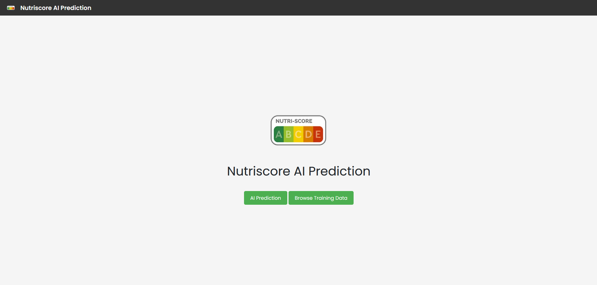
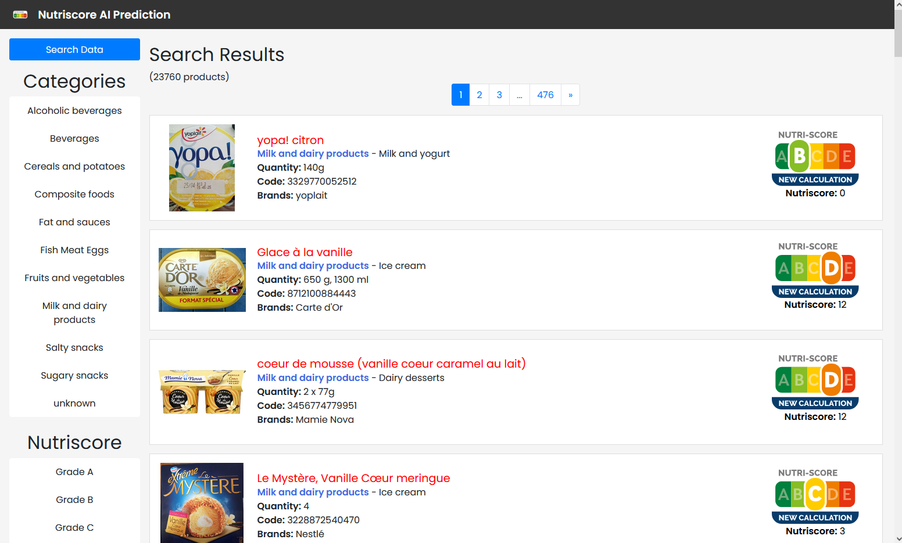
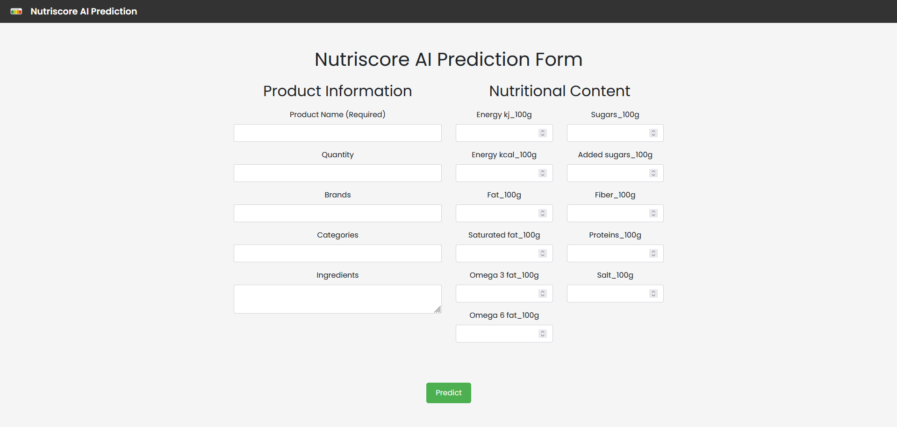

### **<h1 align="center">Modèle d'IA pour la Prédiction du Nutri-Score</h1>**

<p align="center">
  
</p>

<p align="center">
  <a href="README.md">English</a> | <a href="README_fr.md">Français</a>
</p>

Ce projet est une application de machine learning conçue pour prédire le Nutri-Score des produits alimentaires en fonction de diverses données nutritionnelles. L'application est développée en Python avec une interface basée sur Flask, permettant des prédictions locales et un affichage dynamique des données de produits sur le web.

---



---

### **Table des Matières**

1. [Fonctionnalités](#fonctionnalités)
2. [Installation](#installation)
3. [Utilisation](#utilisation)
4. [Utilisation de l'API](#utilisation-de-l-api)
5. [Détails du Modèle](#détails-du-modèle)
6. [Technologies Utilisées](#technologies-utilisées)
7. [Structure du Projet](#structure-du-projet)
8. [Comment le Projet Fonctionne](#comment-le-projet-fonctionne)
9. [Améliorations Futures](#améliorations-futures)

---

### **Fonctionnalités**

- **Prédiction du Nutri-Score** : Prédit les classes de Nutri-Score en utilisant des modèles de machine learning entraînés sur les données d'Open Food Facts.
- **Exploration et Nettoyage des Données** : Utilise diverses techniques de prétraitement, telles que la gestion des valeurs manquantes et des valeurs aberrantes, pour garantir l'exactitude du modèle.
- **Frontend Dynamique avec Pagination** : Une interface web affichant les données des produits, permettant aux utilisateurs de rechercher et filtrer par Nutri-Score et autres caractéristiques nutritionnelles.

---

### **Installation**

1. Cloner le dépôt :
   ```bash
   git clone https://github.com/TonyVallad/Nutriscore-Prediction-Model.git
   cd Nutriscore-Prediction-Model
   ```

2. Installer les dépendances :
   ```bash
   pip install -r requirements.txt
   ```

3. Télécharger les données :
   - Allez sur [Open Food Facts](https://fr.openfoodfacts.org/data).
   - Téléchargez le fichier CSV avec les données des produits et placez-le dans le dossier `static`.

4. Exécuter l'application :
   ```bash
   python run.py
   ```

---

### **Utilisation**

- Démarrez l'application et naviguez vers `http://127.0.0.1:5000/` dans votre navigateur.
- Utilisez l'interface pour explorer les données des produits et prédire les Nutri-Scores.

#### Principales Routes

- **Page d'Accueil (`/`)** : Affiche une page d'introduction avec des options de navigation.
- **Endpoint de Prédiction de l'API (`/api/v1/predict-nutriscore`)** : Permet aux utilisateurs de faire des prédictions via une route API séparée.
- **Liste des Produits (`/training_data`)** : Parcourir et rechercher des produits avec pagination et filtres.
- **Recherche de Données** : Filtrer les produits en fonction des catégories et des classes de Nutri-Score.





---

### **Utilisation de l'API**

Le projet inclut un endpoint API pour effectuer des prédictions de Nutri-Score, permettant une intégration facile avec d'autres applications ou services externes.

- **Endpoint** : `/api/v1/predict-nutriscore`
- **Méthode** : `POST`
- **Content-Type** : `application/json`

#### Exemple de Payload JSON :

```json
{
    "pnns_groups_1": "Snacks sucrés",
    "energy-kcal_100g": 500,
    "fat_100g": 25,
    "saturated-fat_100g": 10,
    "sugars_100g": 40,
    "fiber_100g": 5,
    "proteins_100g": 6,
    "salt_100g": 0.5,
    "sodium_100g": 0.2,
    "fruits-vegetables-nuts-estimate-from-ingredients_100g": 15
}
```

#### Réponse

L'API renverra une réponse JSON contenant le Nutri-Score prédit en fonction des valeurs fournies.

Exemple :
```json
{
    "nutriscore_grade": "e"
}
```

Utilisez cette API pour effectuer des prédictions de Nutri-Score par programmation en envoyant une requête POST avec les données nutritionnelles requises.

---

### **Détails du Modèle**

L'application utilise un `RandomForestClassifier` comme modèle par défaut avec la configuration suivante :

- **Random State** : `42`  
  Assure la reproductibilité en contrôlant l'aléatoire. La définition d'un état aléatoire fixe permet au modèle de produire les mêmes résultats à chaque entraînement.

- **Bootstrap** : `False`  
  Lorsque `False`, le modèle utilise l'ensemble du jeu de données pour construire chaque arbre, au lieu de l'échantillonnage aléatoire avec remise. Cela peut entraîner une variance plus élevée mais peut améliorer la précision dans certains cas.

- **Max Depth** : `30`  
  Limite la profondeur maximale de chaque arbre de décision dans la forêt. Une valeur de `30` restreint la croissance des arbres, contribuant à éviter le surapprentissage en réduisant la complexité du modèle.

- **Min Samples Leaf** : `1`  
  Définit le nombre minimum d'échantillons requis pour être à une feuille (un nœud terminal de l'arbre). Avec `1`, chaque feuille peut représenter un seul échantillon, ce qui permet de capturer des motifs plus détaillés dans les données, mais augmente le risque de surapprentissage.

- **Min Samples Split** : `5`  
  Spécifie le nombre minimum d'échantillons requis pour diviser un nœud. Une valeur de `5` signifie que les nœuds ayant moins de 5 échantillons ne seront pas divisés, aidant ainsi à contrôler la croissance de l'arbre et à réduire le surapprentissage.

- **Number of Estimators** : `300`  
  Indique le nombre d'arbres dans la forêt. Avec `300` estimateurs, le modèle est plus robuste, car il agrège les prédictions de plusieurs arbres individuels, améliorant la généralisation mais augmentant également les besoins en calcul.

- **Verbose** : `1`  
  Contrôle le niveau de détail affiché dans la console pendant l'entraînement. Une valeur de `1` fournit des mises à jour sur la progression de l'entraînement, utile pour suivre les temps d'entraînement plus longs avec plusieurs arbres.

- **Number of Jobs** : `-1`  
  Spécifie le nombre de cœurs de processeur utilisés pour l'entraînement. La définition à `-1` utilise tous les processeurs disponibles, accélérant le processus d'entraînement, surtout pour les ensembles de données volumineux.

Vous pouvez expérimenter avec d'autres modèles en mettant à jour `create_ai_model.py`. Le modèle entraîné est enregistré dans `app/ai-model/`, permettant une intégration et un déploiement sans heurts dans l'application.

---

### **Technologies Utilisées**

- **Python** : Langage principal pour le traitement des données et le machine learning.
- **Flask** : Framework web pour l'interface de l'application.
- **Scikit-learn** : Bibliothèque de machine learning pour le développement de modèles.
- **Jinja2** : Moteur de templates pour la génération dynamique de HTML.

---

### **Structure du Projet**

```plaintext
Nutriscore-Prediction-Model/
│
├── app/
│   ├── ai-model/            # Modèle et fichiers associés
│   ├── routes/              # Routes principales de l'application (par fonctionnalité)
│   ├── static/              # Assets statiques (données CSV, images, CSS)
│   ├── templates/           # Templates HTML
│   ├── __init__.py          # Usine d'application
│
├── config.py                # Fichier de configuration
├── requirements.txt         # Dépendances
├── run.py                   # Point d'entrée principal
└── README.md                # Documentation du projet
```

---

### **Comment le Projet Fonctionne**

1. **Préparation des Données** : Charge et prétraite le jeu de données Open Food Facts, en gérant les valeurs manquantes, les valeurs aberrantes et le redimensionnement des caractéristiques.
2. **Entraînement du Modèle** : Entraîne un modèle de machine learning pour prédire le Nutri-Score en fonction des caractéristiques sélectionnées.
3. **Interface Frontend** : Affiche une liste paginée de produits, permettant le filtrage et la recherche par Nutri-Score et données nutritionnelles.

---

### **Améliorations Futures**

- **API Améliorée** : Étendre l'API pour des prédictions de Nutri-Score plus complètes et une gestion des données, y compris la gestion des informations et de l'état du modèle pour surveiller les performances et la disponibilité du modèle.
- **Template de Statistiques** : Ajouter un template dédié pour afficher divers graphiques et métriques sur le modèle actuel, ainsi que des comparaisons avec d'autres modèles testés.
- **Amélioration de la Préparation des Données** : Améliorer la gestion des valeurs manquantes, le redimensionnement et l'ingénierie des caractéristiques pour des données d'entrée plus propres et robustes.
- **Simplification de l'Exploration des Données** : Fusionner les templates `training_data` et `search_results` en un seul template pour simplifier l'exploration des données.
- **Améliorations de l'Interface Utilisateur** : Affiner le formulaire de prédiction et l'affichage des résultats pour une expérience utilisateur plus conviviale.

---

### **Licence**

Ce projet est sous licence MIT. Vous êtes libre d'utiliser, de modifier et de distribuer ce logiciel dans tout projet, personnel ou commercial, à condition d'inclure une copie de la licence et des droits d'auteur originaux.

Pour plus d'informations, consultez le fichier [LICENSE](LICENSE).